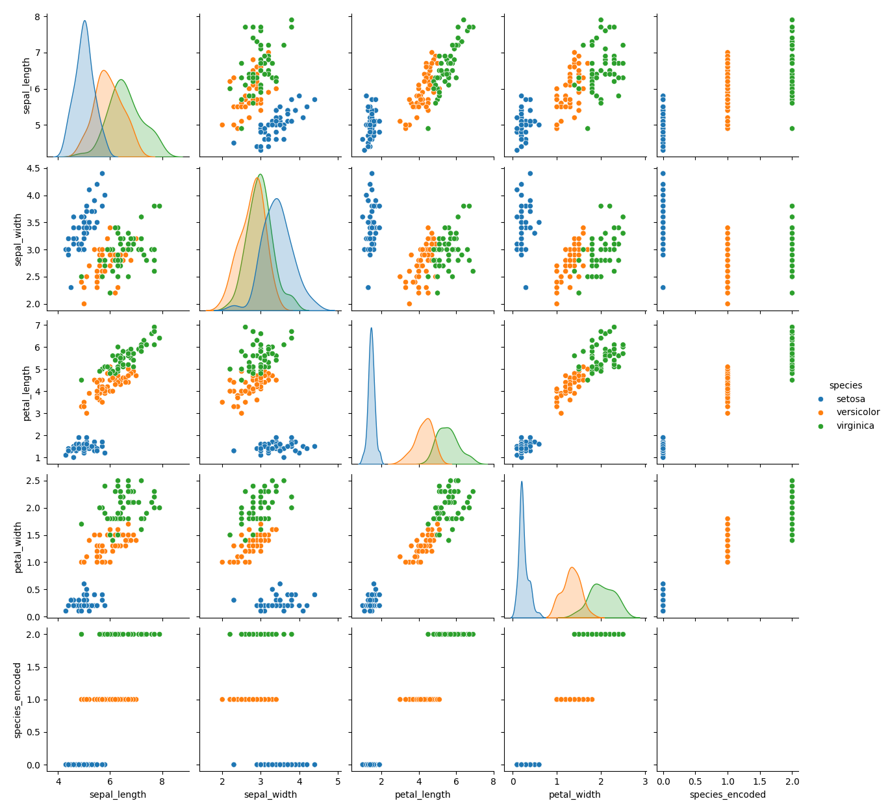
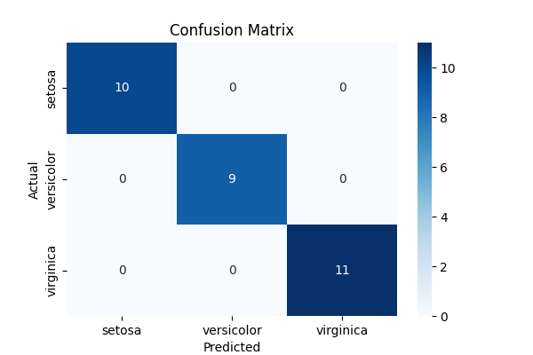

# 🌸 Iris Flower Classification – CodeAlpha Internship

### 📌 Project Overview
This project classifies Iris flower species (Setosa, Versicolor, Virginica) using machine learning.
The model is trained using the Iris dataset and predicts species based on measurements.

### 📂 Files Included
- `iris_classification.ipynb` – Main notebook
- `iris.csv` – Dataset
- `iris_model.pkl` – Trained model
- `/images` – All generated plots

### 🧠 Machine Learning Steps
- Data loading
- EDA (pairplot, correlation heatmap)
- Train–test split
- Random Forest Classifier
- Confusion Matrix + Accuracy
- Prediction using user input

### 📊 Output Images

### 🎯 Accuracy
The model achieved **100% accuracy**.

### 👨‍💻 Author
Muthukaruppan PL  
CodeAlpha Machine Learning Intern